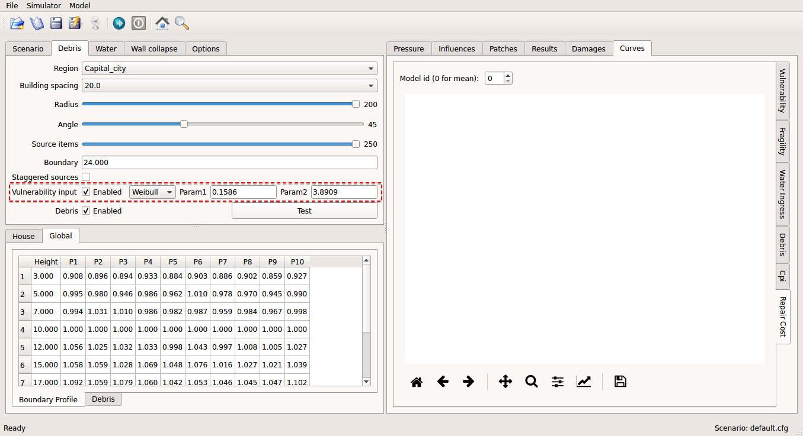
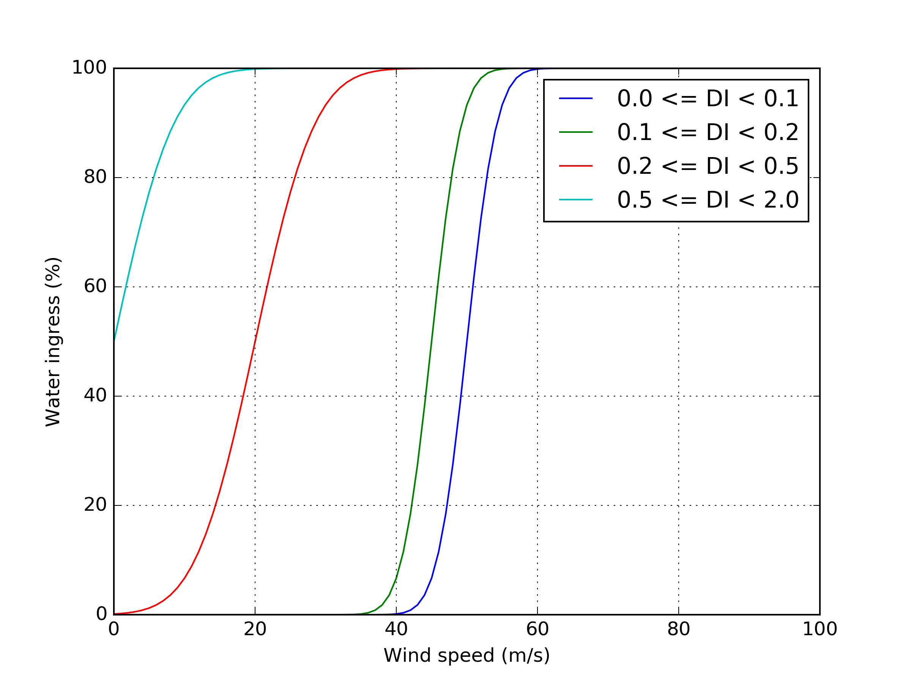

.. _input:

**********
Input Data
**********

The input data for a scenario consists of a configuration file and a large number of files located in three different directories. This chapter provides details of input data using the template of default scenario, which can be downloaded from  `https://github.com/GeoscienceAustralia/vaws/blob/master/scenarios/default <https://github.com/GeoscienceAustralia/vaws/blob/master/scenarios/default>`_. The folder structure of the default scenario is shown :numref:`folder_structure`, which consists of a configuration file (default.cfg) and input directory with three sub-directories (debris, gust_envelope_profiles, and house).

.. _folder_structure:
.. code-block:: none
   :caption: Folder structure

    default
    +-- default.cfg
    +-- input
        +-- debris
        |   +-- debris.csv
        |
        +-- gust_envelope_profiles
        |   +-- cyclonic_terrain_cat2.csv
        |   +-- cyclonic_terrain_cat2.5.csv
        |   +-- cyclonic_terrain_cat3.csv
        |   +-- non_cyclonic.csv
        |
        +-- house
            +-- house_data.csv
            +-- conn_groups.csv
            +-- conn_types.csv
            +-- connections.csv
            +-- zones.csv
            +-- zones_cpe_mean.csv
            +-- zones_cpe_str_mean.csv
            +-- zones_cpe_eave_mean.csv
            +-- zones_edge.csv
            +-- coverages.csv
            +-- coverage_types.csv
            +-- coverages_cpe.csv
            +-- influences.csv
            +-- influence_patches.csv
            +-- damage_costing_data.csv
            +-- damage_factorings.csv
            +-- water_ingress_costing_data.csv
            +-- footprint.csv
            +-- front_facing_walls.csv

.. _configuration_file:

Configuration file
==================

Each simulation requires a configuration file where basic parameter values for the simulation are provided. The configuration file can be created either by editing the template configuration file using a text editor or through GUI.

The configuration file consists of a number of sections, among which *main* and *options* are mandatory while others are optional. An example configuration file is shown in :numref:`default.cfg`.

.. _default.cfg:
.. code-block:: none
   :caption: Example configuration file: default.cfg

    [main]
    no_models = 10
    house_name = Group 4 House
    random_seed = 0
    wind_direction = S
    wind_speed_min = 55
    wind_speed_max = 101
    wind_speed_increment = 0.1
    wind_profiles = 'cyclonic_terrain_cat2.csv'
    regional_shielding_factor = 1.0

    [options]
    debris = True
    diff_shielding = False
    water_ingress = True
    construction_levels = True
    save_heatmaps = True

    [debris]
    region_name = Capital_city
    staggered_sources = False
    source_items = 250
    building_spacing = 20.0
    debris_radius = 200
    debris_angle = 45
    flight_time_mean = 2.0
    flight_time_stddev = 0.8

    [construction_levels]
    levels = low, medium, high
    probabilities = 0.33, 0.34, 0.33
    mean_factors = 0.9, 1.0, 1.1
    cov_factors = 0.58, 0.58, 0.58

    [water_ingress]
    thresholds = 0.1, 0.2, 0.5
    speed_at_zero_wi = 50.0, 35.0, 0.0, -20.0
    speed_at_full_wi = 75.0, 55.0, 40.0, 20.0

    [fragility_thresholds]
    states = slight, medium, severe, complete
    thresholds = 0.02, 0.1, 0.35, 0.9

    [heatmap]
    vmin = 54.0
    vmax = 95.0
    vstep = 21.0

Main section
------------

Parameters of the main section are listed in :numref:`section_main_table`. In the GUI window, they are displayed in the Scenario tab as box shown in :numref:`section_main_fig`.

.. tabularcolumns:: |p{4.0cm}|p{3.0cm}|p{7.0cm}|
.. _section_main_table:
.. csv-table:: Parameters of the main section
    :header: Name, "Name in GUI", "Description"

    no_models, Number of models, "number of models"
    house_name, Model name, "name of model"
    random_seed, Random seed, "a number used to initialize a pseudorandom number generator"
    wind_profiles, Wind profiles, "file name of wind profile"
    regional_shielding_factor, Regional shielding, "regional shielding factor (default: 1.0)"
    wind_speed_min, Wind speed min,  "minimum wind speed (m/s)"
    wind_speed_max, Wind speed max, "maximum wind speed (m/s)"
    wind_speed_increment, Wind speed incr., "the magnitude of the wind speed increment (m/s)"
    wind_direction, Wind dir., "wind direction (S, SW, W, NW, N, NE, E, SE, or RANDOM)"

.. _section_main_fig:
.. figure:: _static/image/section_main.png
    :align: center
    :width: 80 %

    Parameters of main section in the Scenario tab

Options section
---------------

Parameters of the Options section are listed in :numref:`section_options_table`. Note that all the parameter values of the option section should be chosen between `True (or 1)` or `False (or 0)`. In the GUI window, they are displayed in the Debris, Water, Construction, and Options tab as listed in the :numref:`section_options_table`.

.. tabularcolumns:: |p{3.5cm}|p{5.5cm}|p{5.5cm}|
.. _section_options_table:
.. csv-table:: Parameters of options section
    :header: Name, Name in GUI, Description
    :widths: 25, 10, 10

    debris, 'Enabled' tick box in the Debris tab, if True then debris damage will be simulated.
    diff_shielding, 'Differential shielding' tick box in the Options tab, if True then differential shielding effect is applied.
    water_ingress, 'Enabled' tick box in the Water tab, if True then damage due to water ingress will be simulated.
    construction_levels, 'Enabled' tick box in the Construction tab, if True then construction level will be sampled.
    save_heatmaps, 'Save heatmaps' tick box in the Options tab, if True then heatmap plot of each model will be saved.

Debris section
--------------

Parameters of the debris section are listed in :numref:`section_debris_table`. Note that debris section is only required if `debris` is set to be `True` in the options. In the GUI window, they are displayed in the Debris tab as box shown in :numref:`section_debris_fig`.

.. tabularcolumns:: |p{3.5cm}|p{3.5cm}|p{7.5cm}|
.. _section_debris_table:
.. csv-table:: Parameters of debris section
    :header: Name, Name in GUI, "Description"
    :widths: 16, 16, 30

    region_name, Region, one of the region names defined in the :numref:`debris.csv`. Each region has different debris source characteristics.
    building_spacing, Building spacing, distance between debris sources (m)
    debris_radius, Radius, radius (in metre) of debris sources from the modelled house
    debris_angle, Angle, included angle (in degree) of the sector in which debris sources exist
    source_items, Source items, number of debris items per debris sources
    flight_time_mean, Flight time mean, mean flight time of debris items
    flight_time_stddev, Flight time std, standard deviation of flight time of debris items
    staggered_sources, Staggered sources, "if True then staggered sources are used. Otherwise, a grid pattern of debris sources are used."

.. _section_debris_fig:

    Parameters of debris section in Debris tab

Construction_levels section
---------------------------

Parameters of the construction_levels section are listed in :numref:`section_construction_levels_table`. In the GUI window, they are dispalyed in the Construction tab as box shown in :numref:`section_construction_levels_fig`.

.. tabularcolumns:: |p{3.0cm}|p{3.0cm}|p{8.5cm}|
.. _section_construction_levels_table:
.. csv-table::  Parameters of construction_level section
    :header: Name, Name in GUI, "Description"

    levels, Levels, "comma separated list of construction levels (default: low, medium, high)"
    probabilities, probabilities, "comma separated list of probabilities of a modelled house being of a construction level (default: 0.33, 0.34, 0.33)"
    mean_factors, Mean factors, "comma separated list of mean factors of construction levels (default: 0.9, 1.0, 1.1)"
    cov_factors, Cov factors, "comma separated list of cov factors of construction levels (default: 0.58, 0.58, 0.58)"

.. _section_construction_levels_fig:

    Parameters of construction_levels section in Construction tab

Water_ingress section
---------------------

Parameters of the water_ingress section are listed in :numref:`section_water_ingress_table`. In the GUI window, they are displayed in the Water tab as box shown in :numref:`section_water_ingress_fig`. The thresholds define a lower limit of envelope damage index above which the relevant water ingress vs wind speed curve is applied. The speeds at 0% water ingress and speeds at 100% water ingress define cumulative normal distribution used to relate percentage water ingress to wind speed as shown in :numref:`water_ingress_fig`.

.. tabularcolumns:: |p{3.0cm}|p{3.0cm}|p{8.5cm}|
.. _section_water_ingress_table:
.. csv-table::  Parameters of water_ingress section
    :header: Name, Name in GUI, "Description"

    thresholds, DI thresholds, "comma separated list of thresholds of damage indices (default: 0.0, 0.1, 0.2, 0.5)"
    speed_at_zero_wi, Speeds at 0% WI, "comma separated list of maximum wind speed at no water ingress (default: 40.0, 35.0, 0.0, -20.0)"
    speed_at_full_wi, Speeds at 100% WI, "comma separated list of minimum wind speed at full water ingress (default: 60.0, 55.0, 40.0, 20.0)"

.. _water_ingress_fig:

    Water ingress vs. wind speed for different ranges of damage index

.. _section_water_ingress_fig:
.. figure:: _static/image/section_water_ingress.png
    :align: center
    :width: 80 %

    Parameters of water_ingress section in Water tab

Fragility_thresholds
--------------------

Parameters of the fragility_thresholds section are listed in :numref:`section_fragility_thresholds_table`. In the GUI window, they are displayed in the Options tab as box shown in :numref:`section_fragility_thresholds_fig`. The probability of exceeding a damage state :math:`ds` at a wind speed :math:`x` is calculated as :eq:`fragility_eq`:

.. math::
    :label: fragility_eq

    P\left(DS \geq ds\right | x ) = \frac {\sum_{i=1}^N\left[DI_{i|x} \geq t_{ds}\right]}{N}

where :math:`N`: number of models, :math:`DI_{i|x}`: damage index of :math:`i` th model at the wind speed :math:`x`, and :math:`t_{ds}`: threshold for damage state :math:`ds`.

.. tabularcolumns:: |p{3.0cm}|p{3.0cm}|p{8.5cm}|
.. _section_fragility_thresholds_table:
.. csv-table:: Parameters of fragility_thresholds section
    :header: Name, Name in GUI, "Description"
    :widths: 16, 16, 30

    states,  Damage states, "comma separated list of damage states (default: slight, medium, severe, complete)"
    thresholds, Thresholds, "comma separated list of damage states thresholds(default: 0.02, 0.1, 0.35, 0.9)"

.. _section_fragility_thresholds_fig:

    Parameters of fragility_thresholds section in Options tab

Heatmap
-------

Parameters of the heatmap section are listed in :numref:`section_heatmap_table`. In the GUI window, they are displayed in the Options tab as box shown in :numref:`section_heatmap_fig`

.. _section_heatmap_table:
.. csv-table:: Parameters of heatmap section
    :header: Name, Name in GUI, Description
    :widths: 8, 8, 30

    vmin, Lower limit, lower limit of wind speed for heatmap
    vmax, Upper limit, upper limit of wind speed for heatmap
    vstep, No. of steps, number of steps

.. _section_heatmap_fig:
.. figure:: _static/image/section_heatmap.png
    :align: center
    :width: 80 %

    Parameters of heatmap section in Options tab

.. _debris.csv_section:

Input file under `debris` directory
====================================

In the debris directory, `debris.csv` is located where parameter values related to windborne debris are defined. Three types of windborne debris are modelled, as listed in :numref:`debris_types_table`, which include *Compact*, *Rod*, and *Sheet*. Parameter values for each debris type needs to be defined by unique region name, and the defined region name should be referenced in the configuration file.

An example `debris.csv` is shown in :numref:`debris.csv`, in which debris parameters are defined for both `Capital_city` and `Tropical_town`. Note that `Capital_city` is referenced in the example configuration file :numref:`default.cfg`.

.. _debris.csv:
.. code-block:: none
   :caption: Example debris.csv

    Region name,Capital_city,Tropical_town
    Compact_ratio,20,15
    Compact_mass_mean,0.1,0.1
    Compact_mass_stddev,0.1,0.1
    Compact_frontal_area_mean,0.002,0.002
    Compact_frontal_area_stddev,0.001,0.001
    Compact_cdav,0.65,0.65
    Rod_ratio,30,40
    Rod_mass_mean,4,4
    Rod_mass_stddev,2,2
    Rod_frontal_area_mean,0.1,0.1
    Rod_frontal_area_stddev,0.03,0.03
    Rod_cdav,0.8,0.8
    Sheet_ratio,50,45
    Sheet_mass_mean,3,10
    Sheet_mass_stddev,0.9,5
    Sheet_frontal_area_mean,0.1,1
    Sheet_frontal_area_stddev,0.03,0.3
    Sheet_cdav,0.9,0.9

.. _debris_types_table:
.. csv-table:: Debris types
    :header: Name, "Examples"
    :widths: 8, 30

    Compact, "Loose nails screws, washers, parts of broken tiles, chimney bricks, air conditioner units"
    Rod, "Parts of timber battens, purlins, rafters"
    Sheet, "Roof cladding (mainly tiles, steel sheet, flashing, solar panels)"

The parameter values should be provided for each of the debris types as set out in :numref:`debris_item_table`.

.. _debris_item_table:
.. csv-table:: Parameters for each debris item
    :header: Name, "Note"
    :widths: 8, 30

    ratio, "proportion out of debris in percent"
    mass_mean, "mean of mass"
    mass_stddev, "standard deviation of mass"
    frontal_area_mean, "mean of frontal area (:math:`\text{m}^2`)"
    frontal_area_stddev, "standard deviation of frontal area (:math:`\text{m}^2`)"
    cdav, "average drag coefficient"

.. _envelope_profiles_section:

Input files under `gust_envelope_profiles` directory
====================================================

The gust envelope profiles are defined under `gust_envelope_profiles` directory. In the configuration file, file name of the gust envelope profile needs to be referenced as shown in :numref:`default.cfg`.

Example files are provided in the `default sceanrio <https://github.com/GeoscienceAustralia/vaws/blob/master/scenarios/default/input/gust_envelope_profiles>`_  with respect to Australian wind design categories: cyclonic_terrain_cat2.csv, cyclonic_terrain_cat2.5.csv, cyclonic_terrain_cat3.csv, and non_cyclonic.csv

An example of gust envelope profile is provided in :numref:`gust_envelope_profile`, and the corresponding plot is shown in :numref:`wind_profile_fig`.

.. _gust_envelope_profile:
.. code-block:: none
   :caption: Example of gust_envelope_profile

    # Terrain Category 2
    3,0.908,0.896,0.894,0.933,0.884,0.903,0.886,0.902,0.859,0.927
    5,0.995,0.980,0.946,0.986,0.962,1.010,0.978,0.970,0.945,0.990
    7,0.994,1.031,1.010,0.986,0.982,0.987,0.959,0.984,0.967,0.998
    10,1.000,1.000,1.000,1.000,1.000,1.000,1.000,1.000,1.000,1.000
    12,1.056,1.025,1.032,1.033,0.998,1.043,0.997,1.008,1.005,1.027
    15,1.058,1.059,1.028,1.069,1.048,1.076,1.016,1.027,1.021,1.039
    17,1.092,1.059,1.079,1.060,1.042,1.053,1.046,1.045,1.047,1.102
    20,1.110,1.103,1.037,1.068,1.088,1.107,1.068,1.106,1.098,1.103
    25,1.145,1.151,1.069,1.091,1.089,1.196,1.126,1.113,1.099,1.142
    30,1.245,1.188,1.177,1.178,1.192,1.199,1.179,1.165,1.127,1.203

The first row is header, and heights (in metre) are listed in the first column. Profile values along the heights are listed from the second column with comma separation. One wind profile (one column) will be randomly selected for each run of the simulation.

.. _wind_profile_fig:

    Wind gust envelope profile along height.

Input files under `house` directory
===================================

In the house directory, a large number of files are located which are required to set parameter values of the model. The simulation model is assumed to consist of connections and zones. The connections are grouped into a number of connection types, and the connection types are further grouped into connection groups.

house_data.csv
--------------

This file defines parameter values for the model such as replacement cost and dimensions. An example is shown in :numref:`house_data.csv`, and description of each of the parameter values are provided in :numref:`house_data_table`.

.. _house_data.csv:
.. code-block:: none
   :caption: Example house_data.csv

    replace_cost,3220.93
    height,4.5
    length,0.9
    width,9.0
    cpe_cov,0.0
    cpe_k,0.1
    cpe_str_cov,0.0
    cpe_str_k,0.1

.. _house_data_table:
.. csv-table:: Parameters in the house_data.csv
    :header: Name, Type, "Description"
    :widths: 8, 4, 30

    replace_cost, float, "replacement cost of the model ($)"
    height, float, "height of the model (in metre)"
    length, float, "length of the model (in metre)"
    width, float, "width of the model (in metre)"
    cpe_cov, float, "cov of Cpe for sheeting and batten"
    cpe_k, float, "shape factor of Cpe for sheeting and batten"
    cpe_str_cov, float, "cov of Cpe for rafters and eaves"
    cpe_str_k, float, "shape factor of Cpe for rafters and eaves"

.. _conn_groups.csv_section:

conn_groups.csv
---------------

The model is assumed to consist of a number of connection groups. This file defines connection groups and parameter values of the each connection group. An example is shown in :numref:`conn_groups.csv`, and description of each of the parameter values are provided in :numref:`conn_groups_table`.

.. _conn_groups.csv:
.. code-block:: none
   :caption: Example conn_groups.csv

    group_name,dist_order,dist_dir,damage_scenario,trigger_collapse_at,patch_dist
    sheeting,1,col,Loss of roof sheeting,0.0,1
    batten,2,row,Loss of roof sheeting & purlins,0.0,1
    rafter,3,col,Loss of roof structure,0.0,1

.. tabularcolumns:: |p{3.5cm}|p{1.5cm}|p{9.5cm}|
.. _conn_groups_table:
.. csv-table:: Parameters in the conn_groups.csv
    :header: Name, Type, "Description"

    group_name, string, "name of connections group"
    dist_order, integer, "order of checking damage"
    dist_dir, integer, "direction of damage distribution; either 'col', 'row', or ''"
    damage_scenario, string, "damage scenario name defined in damage_costing_data.csv"
    trigger_collapse_at, float, "proportion of damaged connections of the group at which a model is deemed to be collapsed. 0 if ignored"
    patch_dist, integer, "1 if influence patch is applied when connection is damaged otherwise 0"

.. _conn_types.csv_section:

conn_types.csv
--------------

A connection group may consists of a number of connection types which have different parameter values for strength, dead load, and costing area. This file defines connection types and parameter values of the each connection type. An example is shown in :numref:`conn_types.csv`, and description of each of the parameter values are provided in :numref:`conn_types_table`.

.. _conn_types.csv:
.. code-block:: none
   :caption: Example conn_types.csv

    type_name,strength_mean,strength_std,dead_load_mean,dead_load_std,group_name,costing_area
    sheetinggable,1.54,0.16334,0.02025,0.0246,sheeting,0.405
    sheetingeave,4.62,0.28292,0.02025,0.0246,sheeting,0.405
    sheetingcorner,2.31,0.2,0.01013,0.0246,sheeting,0.225
    sheeting,2.695,0.21608,0.0405,0.0246,sheeting,0.81
    batten,3.6,1.26,0.089,0.0708,batten,0.81
    battenend,3.6,1.26,0.089,0.0708,batten,0.405
    batteneave,3.6,1.26,0.089,0.0708,batten,0.405
    battencorner,3.6,1.26,0.089,0.0708,batten,0.225
    endraftertopplate,19.5,5.85,0.84,0.063,rafter,1.238
    endrafterridge,16.5,4.95,1.8,0.135,rafter,1.665
    collarraftertopplate,19.5,5.85,1.68,0.126,rafter,1.845
    collarrafterridge,16.5,4.95,1.13,0.08475,rafter,1.26
    collarraftercollar,2.4,0.48,3.95,0.29625,rafter,1.665
    plainraftertopplate,19.5,5.85,1.68,0.126,rafter,2.475
    plainrafterridge,16.5,4.95,3.6,0.27,rafter,3.33
    weakbatten,3.6,1.26,0.089,0.0708,batten,0.81

.. _conn_types_table:
.. csv-table:: Parameters in the conn_types.csv
    :header: Name, Type, "Description"
    :widths: 10, 9, 30

    type_name, string, "name of connection type"
    strength_mean, float, "mean strength (kN)"
    strength_std, float, "standard deviation of strength"
    dead_load_mean, float, "mean dead load (kN)"
    dead_load_std, float, "standard deviation of dead load"
    group_name, string, "name of connections group"
    costing_area, float, "costing area (:math:`\text{m}^2`)"

.. _connections.csv_section:

connections.csv
---------------

This file defines connections and parameter values of the each connection. An example is shown in :numref:`connections.csv`, and description of each of the parameter values are provided in :numref:`connections_table`.

.. _connections.csv:
.. code-block:: none
   :caption: Example connections.csv

    conn_name,type_name,zone_loc,section,coords
    1,sheetingcorner,A1,1,0,0,0.2,0,0.2,0.5,0,0.5
    2,sheetinggable,A2,1,0,0.5,0.2,0.5,0.2,1,0,1
    3,sheetinggable,A3,1,0,1,0.2,1,0.2,1.5,0,1.5
    4,sheetinggable,A4,1,0,1.5,0.2,1.5,0.2,2,0,2
    5,sheetinggable,A5,1,0,2,0.2,2,0.2,2.5,0,2.5

.. tabularcolumns:: |p{2.0cm}|p{1.0cm}|p{12.5cm}|
.. _connections_table:
.. csv-table:: Parameters in the connections.csv
    :header: Name, Type, "Description"
    :widths: 10, 9, 30

    conn_name, string, "name of connection"
    type_name, string, "name of connection type"
    zone_loc, integer, "zone name corresponding to connection location"
    section, integer, "index of section in which damage distribution occurs"
    coords, float, "comma separated values of x, y coordinates for plotting purpose. Provide 4 sets of x, y coordinates for a rectangular shape."

.. _zones.csv_section:

zones.csv
---------

This file defines zones and parameter values of the each zone. An example is shown in :numref:`zones.csv`, and description of each of the parameter values are provided in :numref:`zones_table`.

.. _zones.csv:
.. code-block:: none
   :caption: Example zones.csv

    name,area,cpi_alpha,wall_dir,coords,
    A1,0.2025,0,0,0,0,0.2,0,0.2,0.5,0,0.5
    A2,0.405,0.5,0,0,0.5,0.2,0.5,0.2,1,0,1
    A3,0.405,1,0,0,1,0.2,1,0.2,1.5,0,1.5
    A4,0.405,1,0,0,1.5,0.2,1.5,0.2,2,0,2
    A5,0.405,1,0,0,2,0.2,2,0.2,2.5,0,2.5

.. tabularcolumns:: |p{2.0cm}|p{1.0cm}|p{12.5cm}|
.. _zones_table:
.. csv-table:: Parameters in the zones.csv
    :header: Name, Type, "Description"
    :widths: 10, 9, 30

    name, string, "name of zone"
    area, float, "area of zone (:math:`\text{m}^2`)"
    cpi_alpha, float, "proportion of the zone's area to which internal pressure is applied"
    coords, float, "comma separated list of x, y coordinates for plotting purpose. Provide 4 sets of x, y coordinates for a rectangular shape."

zones_cpe_mean.csv
------------------

This file defines mean cladding Cpe of each zone with regard to the eight wind directions. An example is shown in :numref:`zones_cpe_mean.csv`, and description of each of the parameter values are provided in :numref:`zones_cpe_mean_table`.

.. _zones_cpe_mean.csv:
.. code-block:: none
   :caption: Example zones_cpe_mean.csv

    name,S,SW,W,NW,N,NE,E,SE
    A1,-1.2,-1.2,-1.2,-1.2,-1.2,-1.2,-1.2,-1.2
    A2,-1.2,-1.2,-1.2,-1.2,-1.2,-1.2,-1.2,-1.2
    A3,-1.2,-1.2,-1.2,-1.2,-1.2,-1.2,-1.2,-1.2
    A4,-1.2,-1.2,-1.2,-1.2,-1.2,-1.2,-1.2,-1.2
    A5,-1.2,-1.2,-1.2,-1.2,-1.2,-1.2,-1.2,-1.2
    A6,-1.2,-1.2,-1.2,-1.2,-1.2,-1.2,-1.2,-1.2
    A7,-0.5,-0.5,-0.5,-0.5,-0.5,-0.5,-0.5,-0.5
    A8,-0.5,-0.5,-0.5,-0.5,-0.5,-0.5,-0.5,-0.5
    A9,-0.5,-0.5,-0.5,-0.5,-0.5,-0.5,-0.5,-0.5
    A10,-0.5,-0.5,-0.5,-0.5,-0.5,-0.5,-0.5,-0.5
    A11,-0.5,-0.5,-0.5,-0.5,-0.5,-0.5,-0.5,-0.5
    A12,-0.5,-0.5,-0.5,-0.5,-0.5,-0.5,-0.5,-0.5
    A13,0,0,0,0,0,0,0,0
    A14,0,0,0,0,0,0,0,0

.. _zones_cpe_mean_table:
.. csv-table:: Parameters in the zones_cpe_mean.csv
    :header: Name, Type, "Description"
    :widths: 10, 9, 30

    name, string, "name of zones"
    S, float, "mean cladding Cpe value in South direction"
    SW, float, "mean cladding Cpe value in South West direction"
    W, integer, "mean cladding Cpe value in West direction"
    NW, float, "mean cladding Cpe value in North East direction"
    N, float, "mean cladding Cpe value in North direction"
    NE, float, "mean cladding Cpe value in North East direction"
    E, integer, "mean cladding Cpe value in East direction"
    SE, float, "mean cladding Cpe value in South East direction"

zones_cpe_str_mean.csv
----------------------

Like zones_cpe_mean.csv, mean Cpe values for zones associated with structural component (e.g., rafter) need to be provided in zones_cpe_str_mean.csv. An example is shown in :numref:`zones_cpe_str_mean.csv`.

.. _zones_cpe_str_mean.csv:
.. code-block:: none
   :caption: Example zones_cpe_str_mean.csv

    name,S,SW,W,NW,N,NE,E,SE
    A1,0,0,0,0,0,0,0,0
    A2,0,0,0,0,0,0,0,0
    A3,0,0,0,0,0,0,0,0
    A4,0,0,0,0,0,0,0,0
    A5,0,0,0,0,0,0,0,0
    A6,0,0,0,0,0,0,0,0
    A7,0,0,0,0,0,0,0,0
    A8,0,0,0,0,0,0,0,0
    A9,0,0,0,0,0,0,0,0
    A10,0,0,0,0,0,0,0,0
    A11,0,0,0,0,0,0,0,0
    A12,0,0,0,0,0,0,0,0
    A13,-1,-1,-1,-1,-1,-1,-1,-1
    A14,-0.4,-0.4,-0.4,-0.4,-0.4,-0.4,-0.4,-0.4

zones_cpe_eave_mean.csv
-----------------------

Like zones_cpe_mean.csv, mean Cpe values for zones at eave need to be provided in zones_cpe_eave_mean.csv. An example is shown in :numref:`zones_cpe_eave_mean.csv`.

.. _zones_cpe_eave_mean.csv:
.. code-block:: none
   :caption: Example zones_cpe_eave_mean.csv

    name,S,SW,W,NW,N,NE,E,SE
    A1,0.7,0.7,0.7,0.7,0.7,0.7,0.7,0.7
    A2,0.35,0.35,0.35,0.35,0.35,0.35,0.35,0.35
    A3,0,0,0,0,0,0,0,0
    A4,0,0,0,0,0,0,0,0
    A5,0,0,0,0,0,0,0,0
    A6,0,0,0,0,0,0,0,0
    A7,0,0,0,0,0,0,0,0
    A8,0,0,0,0,0,0,0,0
    A9,0,0,0,0,0,0,0,0
    A10,0,0,0,0,0,0,0,0
    A11,-0.1,-0.1,-0.1,-0.1,-0.1,-0.1,-0.1,-0.1
    A12,-0.2,-0.2,-0.2,-0.2,-0.2,-0.2,-0.2,-0.2
    A13,0.07,0.07,0.07,0.07,0.07,0.07,0.07,0.07
    A14,-0.02,-0.02,-0.02,-0.02,-0.02,-0.02,-0.02,-0.02

zones_edge.csv
--------------

In zones_edge.csv, for each of the eight direction, 1 is provided for zone within the region of a roof edge, otherwise 0. Zones in the edge region are considered to be subjected to differential shielding if enabled by user. An example is shown in :numref:`zones_edge.csv`.

.. _zones_edge.csv:
.. code-block:: none
   :caption: Example zones_edge.csv

    name,S,SW,W,NW,N,NE,E,SE
    A1,1,1,1,0,0,0,0,0
    A2,1,1,1,0,0,0,0,0
    A3,1,1,1,0,0,0,0,0
    A4,0,1,0,0,0,0,0,0
    A5,0,1,0,0,0,0,0,0
    A6,0,1,0,0,0,0,0,0
    A7,0,0,0,1,0,0,0,0
    A8,0,0,0,1,0,0,0,0
    A9,0,0,0,1,0,0,0,0
    A10,0,0,1,1,1,0,0,0
    A11,0,0,1,1,1,0,0,0
    A12,0,0,1,1,1,0,0,0
    A13,1,1,1,0,0,0,0,0
    A14,0,0,1,1,1,0,0,0

coverages.csv
-------------

This file defines coverages making up the wall part of the envelope of the model. An example is shown in :numref:`coverages.csv`, and description of each of the parameter values are provided in :numref:`coverages_table`. The wall name is defined in :numref:`front_facing_walls.csv`.

.. _coverages.csv:
.. code-block:: none
   :caption: Example coverages.csv

    name,description,wall_name,area,coverage_type
    1,window,1,3.6,Glass_annealed_6mm
    2,door,1,1.8,Timber_door
    3,window,1,1.89,Glass_annealed_6mm
    4,window,1,1.89,Glass_annealed_6mm

.. _coverages_table:
.. csv-table:: Parameters in tge coverages.csv
    :header: Name, Type, "Description"
    :widths: 10, 9, 30

    name, integer, "coverage index"
    description, string, "description"
    wall_name, integer, "wall name"
    area, float, "area (:math:`\text{m}^2`)"
    coverage_type, string, "name of coverage type"

coverage_types.csv
------------------

This file defines types of coverages referenced in the :numref:`coverages.csv`. An example is shown in :numref:`coverage_types.csv`, and description of each of the parameter values are provided in :numref:`coverage_types_table`.

.. _coverage_types.csv:
.. code-block:: none
   :caption: Example coverage_types.csv

    name,failure_momentum_mean,failure_momentum_std,failure_strength_in_mean,failure_strength_in_std,failure_strength_out_mean,failure_strength_out_std
    Glass_annealed_6mm,0.05,0.0,100,0.0,-100,0.0
    Timber_door,142.2,28.44,100,0.0,-100,0.0

.. _coverage_types_table:
.. csv-table:: Parameters in the coverage_types.csv
    :header: Name, Type, "Description"
    :widths: 10, 9, 30

    name, string, "name of coverage type"
    failure_momentum_mean, float, "mean failure momentum (:math:`\text{kg}\cdot\text{m/s}`)"
    failure_momentum_std, float, "standard deviation of failure momentum"
    failure_strength_in_mean, float, "mean failure strength inward direction (kN)"
    failure_strength_in_std, float, "standard deviation of failure strength inward direction"
    failure_strength_out_mean, float, "mean failure strength outward direction (kN)"
    failure_strength_out_std, float, "standard deviation of failure strength outward direction"

coverages_cpe.csv
-----------------

Like zones_cpe_mean.csv, mean Cpe values for coverages are provided in coverages_cpe.csv. An example is shown in :numref:`coverages_cpe.csv`.

.. _coverages_cpe.csv:
.. code-block:: none
   :caption: Example coverages_cpe.csv

    ID,S,SW,W,NW,N,NE,E,SE
    1,2.4,2.4,2.4,2.4,2.4,2.4,2.4,2.4
    2,1.69,1.69,1.69,1.69,1.69,1.69,1.69,1.69
    3,-1.14,-1.14,-1.14,-1.14,-1.14,-1.14,-1.14,-1.14
    4,-1.45,-1.45,-1.45,-1.45,-1.45,-1.45,-1.45,-1.45
    5,0.9,0.9,0.9,0.9,0.9,0.9,0.9,0.9
    6,-0.55,-0.55,-0.55,-0.55,-0.55,-0.55,-0.55,-0.55

influences.csv
--------------

This file defines influence coefficients relating a connection with either another connection(s) or zone(s). The wind load acting on a connection can be computed as the sum of the product of influence coefficient and either wind load on zone or load on another connection. An example is shown in :numref:`influences.csv`, and description of each of the parameter values are provided in :numref:`influences_table`. In this example, connection 1 is related to the zone A1 with coefficient 1.0, and connection 61 is related to the connection 1 with coefficient 1.0. Similarly, connection 121 is related to the zone A13 with coefficient 0.81 and the zone A14 with coefficient 0.19.

.. _influences.csv:
.. code-block:: none
   :caption: Example influences.csv

    Connection,Zone,Coefficent
    1,A1,1.0
    2,A2,1.0
    61,1,1
    62,2,1
    63,3,1
    121,A13,0.81,A14,0.19

.. _influences_table:
.. csv-table:: Parameters in the influences.csv
    :header: Name, "Description"
    :widths: 10, 30

    Connection, "name of connection"
    Zone, "name of either zone or connection associated with the Connection"
    Coefficient, "coefficient value"

influence_patches.csv
---------------------

This file defines influence coefficients of connections when associated connection is failed. An example is shown in :numref:`influence_patches.csv`, and description of each of the parameter values are provided in :numref:`influence_patches_table`. In the example, when connection 121 is failed, influence coefficients of connection 121, 122, 123 are re-defined.

.. _influence_patches.csv:
.. code-block:: none
   :caption: Example influence_patches.csv

    Damaged connection,Connection,Zone,Coefficient
    121,121,A13,0,A14,0
    121,122,A13,1,A14,0
    121,123,A13,1,A14,1
    122,121,A13,1,A14,0
    122,122,A13,0,A14,0
    122,123,A13,0,A14,1

.. _influence_patches_table:
.. csv-table:: Parameters in the influence_patches.csv
    :header: Name, "Description"
    :widths: 10, 30

    Damaged Connection, "name of damaged connection"
    Connection, "name of connection for which the influence coefficients are to be updated"
    Zone, "name of either zone or connection associated with the connection to be updated"
    Coefficient, "new influence coefficient value"

.. _damage_costing_data.csv_section:

damage_costing_data.csv
-----------------------

This file defines damage scenarios referenced in :numref:`conn_groups.csv`. An example is shown in :numref:`damage_costing_data.csv`, and description of each of the parameter values are provided in :numref:`damage_costing_data_table`. The damage cost for each damage scenario :math:`C` is calculated as

.. math::
    :label: damage_costing

    C = x \times \left( A \times C_\text{env} \times R_\text{env} + C_\text{int} \times R_\text{int}\right)

where :math:`x`: proportion of damaged area (:math:`0 \leq x \leq 1`), :math:`A`: surface area, :math:`C_\text{env}`: costing function for envelope, :math:`R_\text{env}`: repair rate for envelope, :math:`C_\text{int}`: costing function for internal, and :math:`R_\text{int}`: repair rate for internal. Two types of costing functions are defined as:

.. math::
    :label: costing_function_types

    f_1 &= c_1 \times x^2 + c_2 \times x + c_3 \\
    f_2 &= c_1 \times x^{c_2}

.. _damage_costing_data.csv:
.. code-block:: none
   :caption: Example damage_costing_data.csv

    name,surface_area,envelope_repair_rate,envelope_factor_formula_type,envelope_coeff1,envelope_coeff2,envelope_coeff3,internal_repair_rate,internal_factor_formula_type,internal_coeff1,internal_coeff2,internal_coeff3,water_ingress_order
    Loss of roof sheeting,116,72.4,1,0.3105,-0.8943,1.6015,0,1,0,0,0,6
    Loss of roof sheeting & purlins,116,184.23,1,0.3105,-0.8943,1.6015,0,1,0,0,0,7
    Loss of roof structure,116,317,1,0.3105,-0.8943,1.6015,8320.97,1,-0.4902,1.4896,0.0036,3

.. _damage_costing_data_table:
.. csv-table:: Parameters in the damage_costing_data.csv
    :header: Name, "Description"
    :widths: 10, 30

    name, name of damage scenario
    surface_area, surface area (:math:`\text{m}^2`)
    envelope_repair_rate, repair rate for envelope ($/:math:`\text{m}^2`)
    envelope_factor_formula_type, type index of costing function for envelope
    envelope_coeff1, :math:`c_1` in costing function for envelope
    envelope_coeff2, :math:`c_2` in costing function for envelope
    envelope_coeff3, :math:`c_3` in costing function for envelope
    internal_repair_rate, repair rate for internal ($)
    internal_factor_formula_type, type index of costing function for internal
    internal_coeff1, :math:`c_1` in costing function for internal
    internal_coeff2, :math:`c_2` in costing function for internal
    internal_coeff3, :math:`c_3` in costing function for internal
    water_ingress_order, order in applying cost induced by water ingress

damage_factorings.csv
---------------------

This file defines a hierarchy of costings, where each row has a parent and child connection type group. When costing the parent group, all child costings will be factored out of the parent. This mechanism avoids double counting of repair costs. An example is shown in :numref:`damage_factorings.csv`.

.. _damage_factorings.csv:
.. code-block:: none
   :caption: Example damage_factorings.csv

    ParentGroup,FactorByGroup
    batten,rafter
    sheeting,rafter
    sheeting,batten

water_ingress_costing_data.csv
------------------------------

This file contains costing information of damage induced by water ingress for various scenarios of structural damage. Each row contains coefficients that are used by costing functions.  An example is shown in :numref:`water_ingress_costing_data.csv`, and description of each of the parameter values are provided in :numref:`water_ingress_costing_data_table`. The water ingress cost :math:`WC` is calculated as

.. math::
    :label: water_ingress

    WC = B(x) \times C

where :math:`x`: envelope damage index prior to water ingress (:math:`0 \leq x \leq 1`), :math:`B`: base cost, and :math:`C`: costing function. Like the damage costing functions, two types of costing functions are defined as :eq:`costing_function_types`.

.. _water_ingress_costing_data.csv:
.. code-block:: none
   :caption: Example water_ingress_costing_data.csv

    name,water_ingress,base_cost,formula_type,coeff1,coeff2,coeff3
    Loss of roof sheeting,0,0,1,0,0,1
    Loss of roof sheeting,5,2989.97,1,0,0,1
    Loss of roof sheeting,18,10763.89,1,0,0,1
    Loss of roof sheeting,37,22125.78,1,0,0,1
    Loss of roof sheeting,67,40065.59,1,0,0,1
    Loss of roof sheeting,100,59799.39,1,0,0,1

.. tabularcolumns:: |p{5.0cm}|p{7.0cm}|
.. _water_ingress_costing_data_table:
.. csv-table:: Parameters in the water_ingress_costing_data.csv
    :header: Name, Description

    name, name of damage scenario
    water_ingress, water ingress in percent
    base_cost, base cost :math:`B`
    formula_type, type index of costing function
    coeff1, :math:`c_1` in costing function
    coeff2, :math:`c_2` in costing function
    coeff3, :math:`c_3` in costing function

footprint.csv
-------------

This file contains information about footprint of the model. Each row contains x and y coordinates of the vertices of the footprint. An example is shown in :numref:`footprint.csv`.

.. _footprint.csv:
.. code-block:: none
   :caption: Example footprint.csv

    footprint_coord
    -6.5, 4.0
    6.5, 4.0
    6.5, -4.0
    -6.5, -4.0

front_facing_walls.csv
----------------------

This file contains wall information with respect to the eight wind direction. Each row contains wall name(s) for a wind direction. An example is shown in :numref:`front_facing_walls.csv`.

.. _front_facing_walls.csv:
.. code-block:: none
   :caption: Example front_facing_walls.csv

    wind_dir,wall_name
    S,1
    SW,1,3
    W,3
    NW,3,5
    N,5
    NE,5,7
    E,7
    SE,1,7

