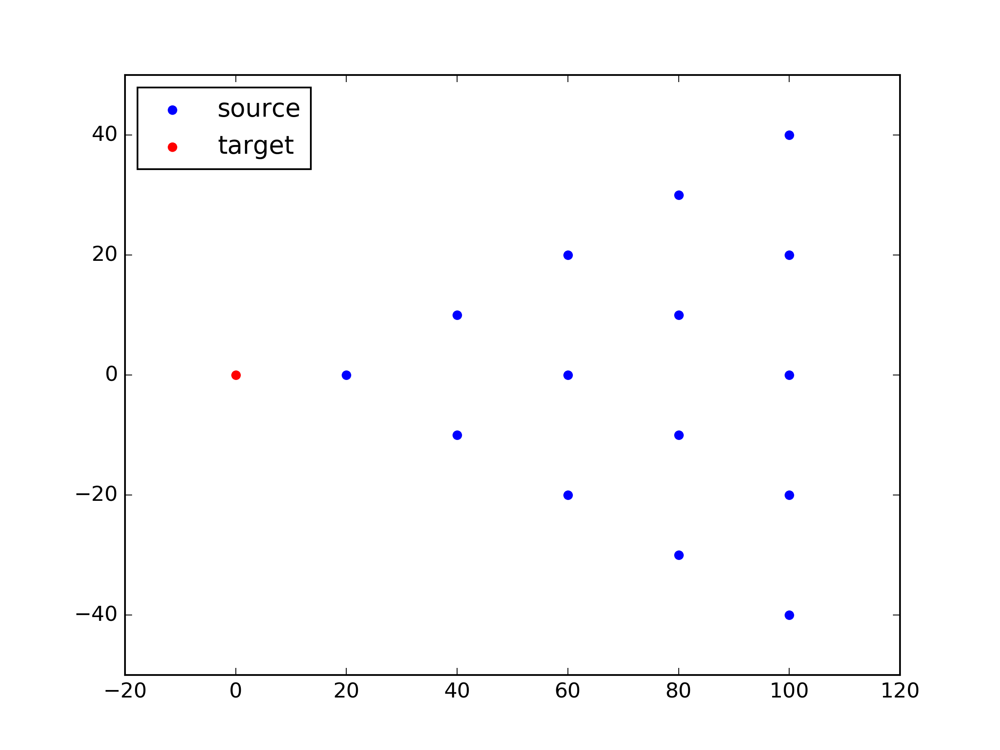
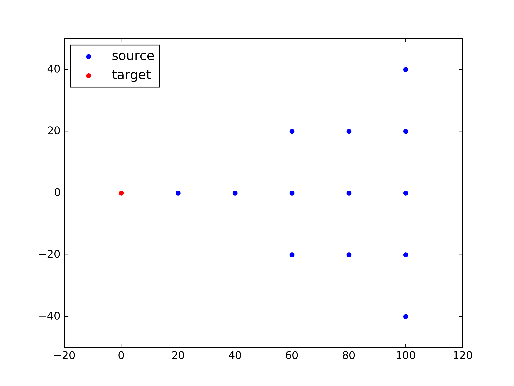

.. _logic:
..
  # with overline, for parts
  * with overline, for chapters
  =, for sections
  -, for subsections
  ^, for subsubsections
  ", for paragraphs

*************
Program Logic
*************

This chapter describes the logic of the program.

Overall logic
=============

The program is built around the following high level sequence:

1. Create a group of models

  - :ref:`For each model <house_module_section>`

    * :ref:`sample wind direction <sample_wind_direction_section>`
    * :ref:`sample wind profile <sample_wind_profile_section>`
    * :ref:`sample construction quality level <sample_construction_level_section>`
    * :ref:`set up coverages <set_coverages_section>`
    * :ref:`set up connections <set_connections_section>`
    * :ref:`set up zones <set_zones_section>`
    * :ref:`set up debris model <set_debris_section>`

2. Calculate damage indices of the models over a range of wind speeds

  - For each wind speed

    - simulate damage for each model

      - calculate free stream wind pressure (qz), optionally applying a regional shielding factor (:py:meth:`.HouseDamage.compute_qz_ms`)
      - calculate zone pressures (:py:meth:`.Zone.calc_zone_pressure`)
      - check damage of envelope coverages by wind load (:py:meth:`.Coverage.check_damage`)
      - calculate connection loads (:py:meth:`.Connection.compute_load`)
      - check damage of each connection by connection group (:py:meth:`.ConnectionTypeGroup.check_damage`)
      - check damage and compute damaged area by connection group (:py:meth:`.ConnectionTypeGroup.compute_damaged_area`)
      - update influence by connection group (:py:meth:`.ConnectionTypeGroup.update_influence`)
      - check for total house collapse event (:py:meth:`.HouseDamage.check_house_collapse`)
      - compute damage index of the model (:py:meth:`.HouseDamage.compute_damage_index`)

      - generate debris and update Cpi in case of internal pressurisation event (:py:meth:`.HouseDamage.check_internal_pressurisation`)

    - calculate increment in mean damage index of the group of models (:py:func:`.update_bucket`)

3. Fit fragility and vulnerability curves and save outputs (:py:func:`.save_results_to_files`)

Detailed logic
==============

This section provides detailed descriptions of each module.

.. _house_module_section:

House module (:py:class:`.House`)
---------------------------------

.. _sample_wind_direction_section:

sample wind direction (:py:meth:`.House.set_wind_orientation`)
^^^^^^^^^^^^^^^^^^^^^^^^^^^^^^^^^^^^^^^^^^^^^^^^^^^^^^^^^^^^^^

The wind direction is set up at the time of model creation, and kept constant during the simulation over a range of wind speeds. If wind_direction (:numref:`section_main_table`) is 'RANDOM', then wind direction is randomly sampled among the eight directions.

.. _sample_wind_profile_section:

sample wind profile (:py:meth:`.House.set_wind_profile`)
^^^^^^^^^^^^^^^^^^^^^^^^^^^^^^^^^^^^^^^^^^^^^^^^^^^^^^^^

A set of gust envelope wind profiles is read from wind_profiles (:numref:`section_main_table`), and one profile is randomly chosen for each model and kept constant during the simulation over a range of wind speeds. The mzcat value at the model height is then calculated by interpolation using the sampled profile over height.

.. _sample_construction_level_section:

sample construction quality level (:py:meth:`.House.set_construction_level`)
^^^^^^^^^^^^^^^^^^^^^^^^^^^^^^^^^^^^^^^^^^^^^^^^^^^^^^^^^^^^^^^^^^^^^^^^^^^^

A set of mean and cov factors for connection strength is defined for each construction quality level with likelihood as listed in :numref:`section_construction_levels_table`. Construction level for each model is determined from a random sampling, and the corresponding mean and cov factors are later multiplied to arithmetic mean and standard deviation of strength as :eq:`mean_cov_factors_eq`:

.. math::
    :label: mean_cov_factors_eq

    \mu_{adj} &= \mu \times f_{\mu} \\
    \sigma_{adj} &= \sigma \times f_{\mu} \times f_{\text{cov}}

where :math:`\mu_{adj}` and :math:`\sigma_{adj}`: adjusted mean and standard deviation of connection strength reflecting construction quality level, respectively, :math:`\mu` and :math:`\sigma`: mean and standard deviation of connection strength, :math:`f_{\mu}` and :math:`f_{\text{cov}}`: mean and cov factors for connection strength.

.. _set_coverages_section:

set up coverages (:py:meth:`.House.set_coverages`)
^^^^^^^^^^^^^^^^^^^^^^^^^^^^^^^^^^^^^^^^^^^^^^^^^^

A set of coverage components(:py:class:`.Coverage`) is defined using the information provided in the input files of :ref:`coverages.csv <coverages.csv_section>`, :ref:`coverage_types.csv <coverage_types.csv_section>` and :ref:`coverages_cpe.csv <coverages_cpe.csv_section>`.
The Cpe and strength values for each coverage component are sampled when it is defined. The windward direction for each coverage component is assigned from among `windward`, `leeward`, `side1`, or `side2`, which is used in determining the windward direction of dominant opening due to coverage failure.

.. _set_zones_section:

set up zones (:py:meth:`.House.set_zones`)
^^^^^^^^^^^^^^^^^^^^^^^^^^^^^^^^^^^^^^^^^^

A set of zone components(:py:class:`.Zone`) is defined using the information provided in the input files of :ref:`zones.csv <zones.csv_section>`, :ref:`zones_cpe_mean.csv <zones_cpe_mean.csv_section>`, :ref:`zones_cpe_str_mean.csv <zones_cpe_str_mean.csv_section>`, :ref:`zones_cpe_eave_mean.csv <zones_cpe_eave_mean.csv_section>`, and :ref:`zones_edges.csv <zones_edges.csv_section>`. The Cpe value for each zone component is sampled when it is defined.

.. _set_connections_section:

set up connections (:py:meth:`.House.set_connections`)
^^^^^^^^^^^^^^^^^^^^^^^^^^^^^^^^^^^^^^^^^^^^^^^^^^^^^^

A set of connection components(:py:class:`.Connection`) is defined using the information provided in the input files of :ref:`conn_groups.csv <conn_groups.csv_section>`, :ref:`conn_types.csv <conn_types.csv_section>`, :ref:`connections.csv <connections.csv_section>`, :ref:`influences.csv <influences.csv_section>`, and :ref:`influence_patches.csv <influence_patches.csv_section>`. The strength and dead load values for each connection component are sampled and influence and influence patch for each connection are also defined with reference to either zone or another connection components.

A set of connection type group(:py:class:`.ConnectionTypeGroup`) is also defined, and reference is created to relate a connection component to a connection type group. A connection type group is further divided into sub-group by section in order to represent load distribution area within the same group. For instance roof sheetings on a hip roof are divided into a number of sheeting sub-groups to represent areas divided by roof ridge lines.

.. _set_debris_section:

set up debris model (:py:meth:`.House.set_debris`)
^^^^^^^^^^^^^^^^^^^^^^^^^^^^^^^^^^^^^^^^^^^^^^^^^^

A debris damage model is set up by referencing the wind direction and coverages of the model. Once the wind direction of the model is assigned to the debris model, the footprint for debris impact is created by rotating the model footprint with regard to the wind direction as set out in :numref:`rotation_angle_table` (:py:attr:`.Debris.footprint`). Note that all the debris sources are assumed to be located in the East of the model when debris impact to the model is simulated.

.. _rotation_angle_table:
.. csv-table:: Rotation angle by wind direction
    :header: Wind direction, Rotation angle (deg)
    :widths: 10, 30

    S or N, 90
    SW or NE, 45
    E or W, 0
    SE or NW, -45

Also walls and coverage components subject to debris impact are selected based on the wind direction (:py:attr:`.Debris.front_facing_walls`). The boundary for debris impact assessment is also defined with the radius of boundary (:py:attr:`.Debris.boundary`)

regional shielding factor
^^^^^^^^^^^^^^^^^^^^^^^^^

If the value of the regional shielding factor is greater than 0.85, then Ms is set to be 1.0, and no adjustment of wind speed is required. When the value is less or equal to 0.85 then Ms is sampled from a probability mass function, which has 1.0, 0.85, and 0.95 with likelihood of 0.63, 0.15, and 0.22, respectively. And the sampled value of Ms is used to adjust wind speed as :eq:`regional_shielding_factor_eq`:

.. math::
    :label: regional_shielding_factor_eq

    V_{adj} = V \times Ms / R

where :math:`V_{adj}`: adjusted wind speed reflecting the regional shielding factor, :math:`V`: wind speed, :math:`Ms`:, :math:`R`: regional shielding factor.

connection load
^^^^^^^^^^^^^^^

The load applied for each of connections are calculated as :eq:`connection_load_eq`:

.. math::
    :label: connection_load_eq

    L_{i} = D_{i} + \sum_{j=1}^{N_{z}} \left(I_{ji} \times A_{j} \times P_{j}\right) + \sum_{j=1}^{N_{c}} \left(I_{ji} \times L_{j}\right)

where :math:`L_{i}`: applied load for :math:`i` th connection, :math:`D_{i}`: dead load of :math:`i` th connection, :math:`N_{z}`: number of zones associated with the :math:`i` th connection, :math:`N_{c}`: number of connections associated with the :math:`i` th connection, :math:`A_{j}`: area of :math:`j` th zone, :math:`P_{j}`: wind pressure on :math:`j` th zone, :math:`I_{ji}`: influence coefficient from :math:`j` th either zone or connection to :math:`i` th connection.

Debris damage module
--------------------

The methdology of modelling damage from wind-borne debris implemented in the code is described in the [JDH2010d]_ and [JDH2010d]_. The debris damage module consists of four parts: 1) debris generation, 2) debris trajectory, 3) debris impact, and 4) debris damage costing.

debris source generation
^^^^^^^^^^^^^^^^^^^^^^^^

The debris sources are generated by calling :py:meth:`.Debris.create_sources`, which requires a number of parameters as shown in the :numref:`debris_source_parameters_fig`.

.. _debris_source_parameters_fig:
.. figure:: _static/image/debris_source_parameters.png
    :align: center
    :width: 80 %

    Distribution of debris sources with parameters

Depending on the value of *staggered_sources*, different layout of debris sources can be generated as shown in :numref:`debris_source_staggered_true_fig` and :numref:`debris_source_staggered_false_fig`.

.. _debris_source_staggered_true_fig:

    Distribution of debris sources generated with debris_radius = 100.0 (m), debris_angle = 45.0 (deg), debris_space = 20.0 (m), and staggered_sources = *True*.

.. _debris_source_staggered_false_fig:

    Distribution of debris sources generated with debris_radius = 100.0 (m), debris_angle = 45.0 (deg), debris_space = 20.0 (m), and staggered_sources = *False*.

debris generation
^^^^^^^^^^^^^^^^^

The mean number of debris items to be generated (:math:`N_{mean}`) is calculated by :eq:`number_of_debris_items_eq`.

.. math::
    :label: number_of_debris_items_eq

    N_{mean} = \operatorname{nint} \left( \Delta{DI} \times N_{items} \right)

where :math:`N_{items}`: number of debris items per source defined in :ref:`3.1.3 <debris_section>`, :math:`\Delta{DI}`: increment in damage index from previous wind step, and :math:`\operatorname{nint}`: nearest integer function.

The number of generated debris items is assumed to follow the Poisson distribution with parameter :math:`\lambda=N_{mean}`. For each debris source, the number of generated debris items is randomly sampled from the distribution, and debris type is randomly chosen as many as number of items with probability proportional to the ratio of each type defined in :numref:`debris_item_table`. The debris types are provided in :ref:`3.2 <debris.csv_section>`:

debris trajectory
^^^^^^^^^^^^^^^^^

For each generated debris item, mass, frontal area, and flight time are sampled from the lognormal distribution with parameter values provided in :ref:`3.1.3 <debris_section>` and :ref:`3.2 <debris.csv_section>`. The flight distance is calculated based on the methodology presented in the Appendix of Lin and Vanmarcke (2008). Note that the original fifth polynomial functions are replaced with quadratic one with the coefficients as listed in :numref:`flight_distance_table`. The computed flight distance by debris type using the fitth and quadratic polynomials is shown in :numref:`flight_distance_fig`.

.. _flight_distance_fig:
.. figure:: _static/image/flight_distance.png
    :align: center
    :width: 80 %

    Flight distance of debris item

.. tabularcolumns:: |p{6.0cm}|p{3.5cm}|p{3.5cm}|
.. _flight_distance_table:
.. csv-table:: Coefficients of quadratic function for flight distance computation by debris type
    :header: Debris type, linear coeff., quadratic coeff.
    :widths: 40, 30, 30

    Compact, 0.011, 0.2060
    Rod, 0.2376, 0.0723
    Sheet, 0.3456, 0.072

The probability distribution of point of landing of the debris in a horizontal plane is assumed to follow a bivariate normal distribution as :eq:`bivariate_normal`.

.. math::
    :label: bivariate_normal

    f_{x,y} = \frac{1}{2\pi\sigma_x\sigma_y}\exp\left[-\frac{(x-d)^2}{2\sigma_x^2}-\frac{y^2}{2\sigma_y^2}\right]

where :math:`x` and :math:`y` are the coordinates of the landing position of the debris, :math:`\sigma_x` and :math:`\sigma_y`: standard deviation for the coordinates of the landing position, and :math:`d`: expected flight distance. The value of :math:`\sigma_x` and :math:`\sigma_y` are set to be :math:`d/3` and :math:`d/12`, respectively.

Either if the landing point is within the footprint of the model or if the line linking the source to the landing point intersects with the footprint of the model and the landing point is within the boundary, then it is assumed that an impact has occurred. The criteria of debris impact is illustrated in the :numref:`debris_impact_criteria_fig` where blue line represents debris trajectory with impact while red line represents one without impact.

.. _debris_impact_criteria_fig:
.. figure:: _static/image/debris_impact.png
    :align: center
    :width: 70 %

    Graphical presentation of debris impact criteria

Following Lin and Vanmarcke 2008, the ratio of horizontal velocity of the windborne debris object to the wind gust velocity is modelled as a random variable with a Beta distribution as :eq:`beta_dist`.

.. math::
    :label: beta_dist

    \frac{u_m}{V_s} \sim Beta(\alpha, \beta)

where :math:`u_m`: the horizontal velocity of the debris object, :math:`V_s`: the local (gust) wind speed, :math:`\alpha` and :math:`\beta` are two parameters of the Beta distribution and estimated as :eq:`beta_dist_a_b`.

.. math::
    :label: beta_dist_a_b

    \alpha &= E \times \nu \\
    \beta &= \nu \times (1 - E)

where :math:`E`: the expected value and :math:`\nu=\alpha + \beta`.

The expected value (:math:`E`) and the parameter (:math:`\nu`) are assumed to be as :eq:`velocity_debris`.

.. math::
    :label: velocity_debris

    E &= 1-\exp\left(-b\sqrt{x}\right) \\
    \nu &= \max\left[\frac{1}{E}, \frac{1}{1-E}\right] + 3.0

where :math:`x`: the flight distance, :math:`b`: a dimensional parameter calucalted as :eq:`b`. If :math:`E` is 1, then :math:`\alpha` and :math:`\beta` are assigned with 3.996 and 0.004, respectively.

.. math::
    :label: b

    b = \sqrt{\frac{\rho_aC_{D,av}A}{m}}

where :math:`\rho_a`: the air density, :math:`C_{D,av}`: an average drag coefficient, :math:`A`: the frontal area, and :math:`m`: the mass of the object.

The momentum :math:`\xi` is calculated using the sampled value of the ratio, :math:`\frac{u_m}{V_s}` as :eq:`momentum`.

.. math::
    :label: momentum

    \xi = \left(\frac{u_m}{V_s}\right) \times m \times V_s

debris impact
^^^^^^^^^^^^^

Based on the methodology presented in HAZUS and Lin and Vanmacke (2008), the number of impact :math:`N` is assumed to follow a Poisson distribution as :eq:`poisson_eqn`.

.. math::
    :label: poisson_eqn

    N &\sim \operatorname{Pois}(\lambda) \\
    \lambda &= N_v \cdot q \cdot F_{\xi}(\xi>\xi_d)

where :math:`N_v`: number of impacts at a single wind speed, :math:`q`: proportion of coverage area out of the total area of envelope, :math:`F_{\xi}`: the cumulative distribution of momentum, and :math:`\xi_d`: threshold of momentum or energy for damage of the material of the coverage.

The probability of damage can be calculated based on the Poisson distribution as :eq:`p_d`.

.. math::
    :label: p_d

    P_D = 1 - P(N=0) = 1-\exp\left[-\lambda\right]

:math:`q` and :math:`F_{\xi}(\xi>\xi_d)` are estimated for each coverage. If the material of the coverage is glass, then :math:`P_D` is computed and compared against a random value sampled from unit uniform distribution to determine whether the coverage is damaged or not. For coverage with non-glass material, a random value of number of impact is sampled from the Poisson distribution with :math:`\lambda`, and damaged coverage area is then computed assuming that affected area by debris impact is 1.

.. _water_ingress_section:

Water ingress
-------------

The damage cost induced by water ingress is estimated over the following three steps:

1) estimate amount of water ingress (:py:func:`.compute_water_ingress_given_damage`)

The amount of water ingress is estimated based on the relationship between water ingress and wind speed, which is listed in :numref:`section_water_ingress_table`. The estimated damage index prior to water ingress is used to choose the right curve as shown in :numref:`water_ingress_fig`.

2) determine damage scenario (:py:meth:`.HouseDamage.determine_scenario_for_water_ingress_costing`)

The damage scenario for water ingress is determined based on the order of damage scenario as listed in :numref:`damage_costing_data_table`. One damage scenario is selected by the order among the damage scenarios with which damage area of connection associated is greater than zero. When the damage index is zero (or no connection damage yet), then damage scenario of 'WI only' is used.

3) calculate cost for water ingress damage (:py:meth:`.HouseDamage.compute_water_ingress_cost`)

The cost for water ingress damage is estimated using the data provided in :ref:`3.4.17 <water_ingress_costing_data.csv_section>`. The example plot for the scenario of *loss of roof sheeting* is shown in :numref:`water_ingress_cost_fig`. The cost for water ingress damage is estimated using the curve for water ingress closest to the estimated amount of water ingress.

.. _water_ingress_cost_fig:
.. figure:: _static/image/wi_costing_roof_sheeting.png
    :align: center
    :width: 80 %

    Relationship between cost due to water ingress damage and damage index

Cpe
---

The external pressure coefficient, :math:`C_{pe}` is used in computing zone pressures, and is sampled from Type III extreme value distribution (:py:meth:`.stats.sample_gev`) which has the cumulative distribution function and probability density as :eq:`cdf_gev` and :eq:`pdf_gev`, respectively.

.. math::
    :label: cdf_gev

    F(s; k) = \exp(-(1-ks)^{1/k})

.. math::
    :label: pdf_gev

    f(s; a, k) = \frac{1}{a}(1-ks)^{1/k-1} \exp(-(1-ks)^{1/k})

where :math:`s=(x-u)/a`, :math:`u`: location factor (:math:`\in \rm I\!R`), :math:`a`: scale factor (:math:`> 0`), and :math:`k`: shape factor (:math:`k\neq0`).

The mean and standard deviation are calculated as :eq:`mean_sd`:

.. math::
    :label: mean_sd

    \operatorname{E}(X) &= u + \frac{a}{k}\left[1-\Gamma(1+k)\right] \\
    \operatorname{SD}(X) &= \frac{a}{k}\sqrt{\Gamma(1+2k)-\Gamma^{2}(1+k)}

The :math:`u` and :math:`a` can be estimated given :math:`c_v\left(=\frac{SD}{E}\right)` and :math:`k` values as :eq:`a_u`:

.. math::
    :label: a_u

    a &= \operatorname{E} \frac{c_v}{B} \\
    u &= \operatorname{E} - a \times A

where :math:`A=(1/k)\left[1-\Gamma(1+k)\right]` and :math:`B=(1/k)\sqrt{\Gamma(1+2k)-\Gamma^{2}(1+k)}`.

Calculate damage index
----------------------

The damage index is calculated over the following steps:

1) calculate sum of damaged area by connection group (:py:meth:`.HouseDamage.compute_area_by_group`)

2) Apply damage factoring (:py:meth:`.HouseDamage.apply_damage_factoring`)

In order to avoid double counting of repair cost, damage cost associated with child group(s) will be factored out of damage cost of the parent group as explained in :ref:`3.4.16 <damage_factorings.csv_section>`.

3) Calculate sum of damaged area by damage scenario (:py:meth:`.HouseDamage.compute_area_by_scenario`)

A damage scenario is assigned to each connection type group as explained in :ref:`3.4.2 <conn_groups.csv_section>`.

4) calculate total damage cost and damage index prior to water ingress (:math:`DI_p`) as :eq:`di_prior`:

.. math::
    :label: di_prior

    DI_p = \frac{\sum_{i=1}^{S}C_i}{R}

where :math:`S`: number of damage scenario, :math:`C_i`: damage cost for :math:`i` th damage scenario, and :math:`R`: total replacement cost.

5) Calculate cost by water ingress damage, :math:`C_{wi}` if required as explained in :ref:`5.x <water_ingress_section>`

6) calculate damage index as :eq:`di`:

.. math::
    :label: di

    DI = \frac{\sum_{i=1}^{S}C_i + C_{wi}}{R}

Cpi
---

The internal pressure coefficient, |Cpi| is determined based on :numref:`cpi_no_dominant_table` and :numref:`cpi_dominant_table` depending on the existence of dominant opening by either coverage failure or debris breach, which are revised from Tables 5.1(A) and 5.1(B) of AS/NZS 1170.2:2011, respectively.

.. tabularcolumns:: |p{6.0cm}|p{3.5cm}|
.. _cpi_no_dominant_table:
.. csv-table:: |Cpi| for buildings without dominant openings
    :header: condition, |Cpi|
    :widths: 10, 9

    All walls equally breached, -0.3
    Two or three windward walls equally breached, 0.2
    Two or three non-windward walls equally breached, -0.3

.. tabularcolumns:: |p{4.0cm}|p{3.5cm}|p{3.5cm}|p{3.5cm}|
.. _cpi_dominant_table:
.. csv-table:: |Cpi| for buildings with dominant openings
    :header: ratio of dominant opening to total open area (:math:`r`), dominant opening on windward wall, dominant opening on leeward wall, dominant opening on side wall
    :widths: 10, 9, 10, 10

    :math:`r <` 0.5, -0.3, -0.3, -0.3
    0.5 :math:`\leq r <` 1.5, 0.2, -0.3, -0.3
    1.5 :math:`\leq r <` 2.5, 0.7 |Cpe|, |Cpe|, |Cpe|
    2.5 :math:`\leq r <` 6.0, 0.85 |Cpe|, |Cpe|, |Cpe|
    :math:`r \geq` 6.0, |Cpe|, |Cpe|, |Cpe|

Zone module
-----------

zone pressure
^^^^^^^^^^^^^

The zone pressure is calculated as :eq:`zone_pressure`:

.. math::
    :label: zone_pressure

    P = q_z \times (C_{pe} - \alpha_{C_{pi}} \times C_{pi}) \times d_s

where :math:`q_z`:, :math:`C_{pe}`:, :math:`C_{pi}`, :math:`\alpha_{C_{pi}}`, and :math:`d_s`:

differential shielding
^^^^^^^^^^^^^^^^^^^^^^

If the value of diff_shielding is True, then differential shielding effect is considered in calculating zone pressure. The differential shielding is computed as follows:

  .. code-block:: python

    front_facing = self.is_roof_edge[wind_dir_index]
    if building_spacing == 40 and ms >= 1.0 and front_facing == 0:
        dsd = ms ** 2.0
    elif building_spacing == 20 and front_facing == 1:
        dsd = ms ** 2.0
        if ms <= 0.85:
            dsn = 0.7 ** 2.0
        else:
            dsn = 0.8 ** 2.0

update influence coefficient
^^^^^^^^^^^^^^^^^^^^^^^^^^^^
The influence coefficient is used to associate one connection with another either zone or connection with regard to load distribution. For instance, if connection 1 has influences of connection 2 and 3 with coefficient 0.5 and 0.5, respectively, then the load on connection 1 is equal to the sum of 0.5 times load on connection 2 and 0.5 times load on connection 3, as shown in :eq:`connection_load_eq`.

Once a connection is failed, then load on the failed connection needs to be distributed to other connections accordingly, which means that influence coefficient needs to be revised.

Given the failure of connection of either sheeting and batten connection type group, the influence coefficient will be distributed evenly to the next connection of the same type to the distribution direction (*dist_dir* listed in :numref:`conn_groups_table`). Note that *patch_dist* of both sheeting and batten connection group are set to be *False*.

Unlike sheeting and batten, a connection of Rafter group fails, then influence coefficients associated with the failed connection are replaced with a new set of influence coefficients, which is termed "patch". In the current implementation, the patch is defined for a single failed connection. Thus the failure order of the connections may make difference in the resulting influences as shown in :numref:`patch_example_table`.

.. _patch_example_table:
.. csv-table::  Example of how patch works
    :header: Failed connection, Connection, "Patch (connection: influence coeff.)"

    1, 3, "1:0.0, 2:0.5, 3:0.5"
    2, 3, "1:0.5, 2:0.0, 3:1.0"
    1 and then 2, 3, "1:0.0, 2:0.0, 3:1.0"
    2 and then 1, 3, "1:0.0, 2:0.0, 3:0.5"

coverage
^^^^^^^^

The coverages are making up the wall part of the envelope of the model. Two failure mechanism are implemented: 1) failure by wind load and 2) failure by windborne debris.
The coverage failure by wind load is very similar to the failure of connection by wind, in which wind load is first calculated as :eq:`load_coverage_eq` and then compared against its strengths in both directions to check the failure.

.. math::
    :label: load_coverage_eq

    L = 0.9 \times q_{z} \times \left(C_{pe} - C_{pi}\right) \times A

vulnerability
^^^^^^^^^^^^^

.. math::
    :label: vulnerabilit

    P = q_z \times (C_{pe} - \alpha_{C_{pi}} \times C_{pi}) \times d_s

.. |Cpe| replace:: :math:`C_{pe}`
.. |Cpi| replace:: :math:`C_{pi}`

..
  .. literalinclude:: ../../vaws/model/debris.py
     :language: python
     :pyobject: Debris.create_sources
